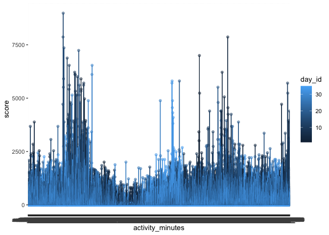
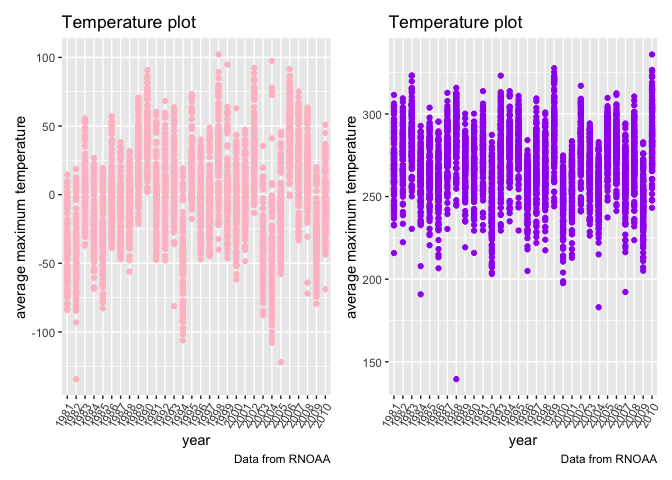
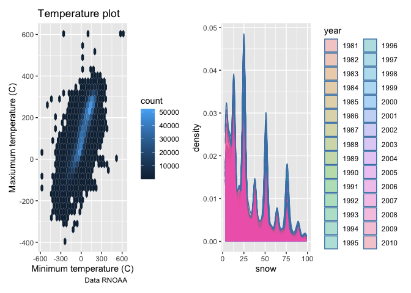

Untitled
================
Ruihan Zhang
2022-10-13

## R Markdown

This is an R Markdown document. Markdown is a simple formatting syntax
for authoring HTML, PDF, and MS Word documents. For more details on
using R Markdown see <http://rmarkdown.rstudio.com>.

When you click the **Knit** button a document will be generated that
includes both content as well as the output of any embedded R code
chunks within the document. You can embed an R code chunk like this:

``` r
summary(cars)
```

    ##      speed           dist       
    ##  Min.   : 4.0   Min.   :  2.00  
    ##  1st Qu.:12.0   1st Qu.: 26.00  
    ##  Median :15.0   Median : 36.00  
    ##  Mean   :15.4   Mean   : 42.98  
    ##  3rd Qu.:19.0   3rd Qu.: 56.00  
    ##  Max.   :25.0   Max.   :120.00

## Including Plots

You can also embed plots, for example:

<!-- -->

Note that the `echo = FALSE` parameter was added to the code chunk to
prevent printing of the R code that generated the plot.

``` r
library(tidyverse)
```

    ## ── Attaching packages ─────────────────────────────────────── tidyverse 1.3.2 ──
    ## ✔ ggplot2 3.3.6      ✔ purrr   0.3.4 
    ## ✔ tibble  3.1.8      ✔ dplyr   1.0.10
    ## ✔ tidyr   1.2.0      ✔ stringr 1.4.1 
    ## ✔ readr   2.1.2      ✔ forcats 0.5.2 
    ## ── Conflicts ────────────────────────────────────────── tidyverse_conflicts() ──
    ## ✖ dplyr::filter() masks stats::filter()
    ## ✖ dplyr::lag()    masks stats::lag()

``` r
library(dplyr)
library(tidyr)
library(patchwork)
```

``` r
 accel_data = read_csv(file = "accel_data/accel_data.csv") %>%
  janitor::clean_names()  %>% 
  mutate(
    weekday_weekend = case_when(
      day ==  "Sunday" ~ "weekend",
       day ==  "Saturday" ~ "weekend",
       day ==  "Monday" ~ "weekday",
        day ==  "Tuesday" ~ "weekday",
         day ==  "Wednesday" ~ "weekday",
          day ==  "Thursday" ~ "weekday",
           day ==  "Friday" ~ "weekday"
           
    )) %>%
  select(., week, day_id, day, weekday_weekend, everything())  %>%
  mutate(., total_activity = rowSums(.[5:1443], na.rm = TRUE)) %>% 
  select(., week, day_id, day, weekday_weekend, total_activity, everything())
```

    ## Rows: 35 Columns: 1443
    ## ── Column specification ────────────────────────────────────────────────────────
    ## Delimiter: ","
    ## chr    (1): day
    ## dbl (1442): week, day_id, activity.1, activity.2, activity.3, activity.4, ac...
    ## 
    ## ℹ Use `spec()` to retrieve the full column specification for this data.
    ## ℹ Specify the column types or set `show_col_types = FALSE` to quiet this message.

``` r
accel_table = accel_data %>% 
  group_by(accel_data$day_id, accel_data$total_activity) %>% 
  summarize(
  )
```

    ## `summarise()` has grouped output by 'accel_data$day_id'. You can override using
    ## the `.groups` argument.

``` r
accel_table
```

    ## # A tibble: 35 × 2
    ## # Groups:   accel_data$day_id [35]
    ##    `accel_data$day_id` `accel_data$total_activity`
    ##                  <dbl>                       <dbl>
    ##  1                   1                     480542.
    ##  2                   2                      78760.
    ##  3                   3                     376253 
    ##  4                   4                     630800 
    ##  5                   5                     355860.
    ##  6                   6                     306992.
    ##  7                   7                     340061.
    ##  8                   8                     568838 
    ##  9                   9                     295430 
    ## 10                  10                     607153 
    ## # … with 25 more rows

There are 35 observations. The variables are week, day_id, day,
weekday_weekend, total_activity, and from activity_1 to activity_1440.
The dimension is 1445 \* 35.

``` r
accel_data1 = pivot_longer(accel_data, activity_1:activity_1440, names_to = "activity_minutes", 
                           values_to = "score")  
```

``` r
plot = ggplot(accel_data1, aes(x = activity_minutes, y = score, color = day_id)) + geom_point(alpha = .5) + geom_line()
plot
```

<!-- --> People in the
study have the better performance of the physical activity during the
beginning and the later time of the day.

``` r
devtools::install_github("p8105/p8105.datasets", force = TRUE)
```

    ## Downloading GitHub repo p8105/p8105.datasets@HEAD

    ## * checking for file ‘/private/var/folders/sx/37221km14kb6gs7j_5lzmhp00000gn/T/RtmpxccniM/remotes383969620e3/P8105-p8105.datasets-412759e/DESCRIPTION’ ... OK
    ## * preparing ‘p8105.datasets’:
    ## * checking DESCRIPTION meta-information ... OK
    ## * checking for LF line-endings in source and make files and shell scripts
    ## * checking for empty or unneeded directories
    ## * building ‘p8105.datasets_0.0.1.tar.gz’

``` r
library(p8105.datasets)
data("ny_noaa")
```

``` r
nynoaadat_data = ny_noaa %>%
  janitor::clean_names() %>% 
  separate(., col = date, into = c('year', 'month', 'day')) %>% 
  mutate(., prcp = prcp / 10) %>% 
  mutate(month = as.character(month)) %>% 
  mutate(id = as.character(id),tmax=as.numeric(tmax),tmin=as.numeric(tmin))
```

The size is 9 \* 2595176. The key variables are id, year, month, day,
prcp, snow, snwd, tmax, and tmin. The missing data of prcp is 0.0561958.
The missing data of snow is 0.146896. The missing data of snwd is
0.2280331. The missing data of tmax is 0.4371025. The missing data of
tmin is 0.4371264.

``` r
nynoaadat_data1 = select(nynoaadat_data, id, year, month, tmax) %>% 
  filter(month == "01") %>% 
  drop_na(tmax)
```

``` r
  pic1=
  nynoaadat_data1 %>%
  group_by(year, id) %>% 
  summarize(
    tmax_mean=mean(tmax)
  )               %>%
  ggplot(aes(x=year,y=tmax_mean))+geom_point(color = "pink") + theme(axis.text.x = element_text(angle = 60, hjust = 1)) +
  labs(
    title = "Temperature plot",
    x = "year",
    y = "average maximum temperature",
    caption = "Data from RNOAA"
  ) 
```

    ## `summarise()` has grouped output by 'year'. You can override using the
    ## `.groups` argument.

``` r
nynoaadat_data2 = select(nynoaadat_data, id, year, month, tmax) %>% 
  filter(month == "07") %>% 
  drop_na(tmax)
```

``` r
 pic2=
  nynoaadat_data2 %>%
  group_by(year, id) %>% 
  summarize(
    tmax_mean=mean(tmax)
  )               %>%
  ggplot(aes(x=year,y=tmax_mean))+geom_point(color = "purple") +  theme(axis.text.x = element_text(angle = 60, hjust = 1)) +
  labs(
    title = "Temperature plot",
    x = "year",
    y = "average maximum temperature",
    caption = "Data from RNOAA"
  )
```

    ## `summarise()` has grouped output by 'year'. You can override using the
    ## `.groups` argument.

``` r
pic1 + pic2
```

<!-- --> For snowfall,
the most commonly observed values are 0, because the probability of snow
occuring is low.

``` r
part1 = nynoaadat_data %>% 
  ggplot(aes(x = tmin, y = tmax)) + 
  geom_hex () +
  labs(
    title = "Temperature plot",
    x = "Minimum temperature (C)",
    y = "Maxiumum temperature (C)",
    caption = "Data RNOAA"
  )
```

``` r
part2 = nynoaadat_data %>% 
  filter(snow > 0 & snow < 100) %>%
  ggplot(aes(x = snow, fill = year)) + 
  geom_density(alpha = 0.3, adjust = 0.5, color='steelblue')

part1+part2
```

    ## Warning: Removed 1136276 rows containing non-finite values (stat_binhex).

<!-- -->
